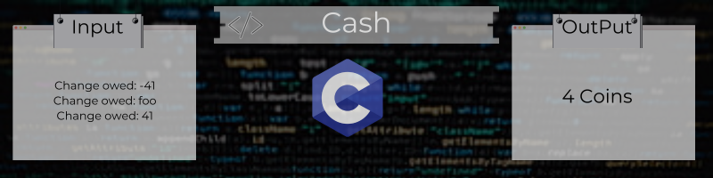
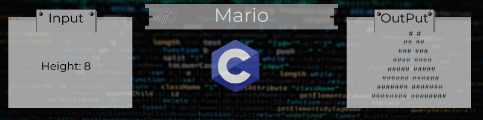

# cs50x-C
C: Source &amp; machine code, compiler. Correctness, design, style. Visual Studio Code: syntax highlighting. Escape sequences, header files, libraries. Manual pages for documentation. Types, conditionals, variables, loops. Linux: GUI &amp; CLI. Constants, comments, pseudocode. Operators, int overflow, float imprecision.

## First Week Projects:

## Lab

### [Population](https://github.com/Henalecam/cs50x-C/tree/main/population):
Say we have a population of **n llamas**. Each year, **n / 3 new llamas are born**, and **n / 4 llamas pass away**.

For example, if we were to start with **n = 1200 llamas**, then in the first year, **1200 / 3 = 400 new llamas would be born and 1200 / 4 = 300 llamas would pass away**. At the end of that year, we would have **1200 + 400 - 300 = 1300 llamas**.

To try another example, if we were to start with **n = 1000 llamas**, at the end of the year, we would have **1000 / 3 = 333.33** new llamas. We can’t have a decimal portion of a llama, though, so we’ll truncate the decimal to get **333 new llamas born. 1000 / 4 = 250 llamas will pass away**, so we’ll end up with a **total of 1000 + 333 - 250 = 1083 llamas at the end of the year.**

## Problems

### [Credit](https://github.com/Henalecam/cs50x-C/tree/main/credit)
The program we’ll write will be called **credit**. And it will **allow a user to type in a credit card number and then, indicate** whether it is a **valid American Express, MasterCard, or Visa card number**, per the definitions of each’s format herein.

###  [Cash](https://github.com/Henalecam/cs50x-C/tree/main/cash)
The program we'll write will be called **cash** and it will **calculate the minimum number of coins required to give a user change**.

### [Mario](https://github.com/Henalecam/cs50x-C/tree/main/mario-more)
The program we’ll write will be called **mario**. And let’s **allow the user to decide just how tall the pyramids should be** by first prompting them for a positive integer between, say, **1 and 8**, inclusive.

### [Hello](https://github.com/Henalecam/cs50x-C/tree/main/hello)

The program we’ll write will be called **hello**. And it will **print out a simple greeting to the user of our program**.

